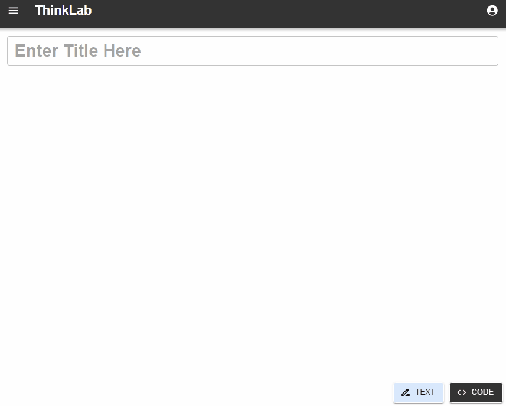

# ThinkLab React Frontend

## Author: Alvaro E. BL

## Main Technologies

- **React**
- **Typescript**
- **Redux**
- **Graphql**
- **MongoDB**
- **Apollo Client**
- **React-Router**
- **Material-UI**
- **Emotion**
- **Jest**
- **React Testing Library**

## Summary

ThinkLab's frontend is a sophisticated and highly interactive user interface designed to complement its [node-express API](https://github.com/wolf-ed/thinklab_be), providing users with a seamless experience for remote code execution and document management across various devices. The frontend is built with modern web technologies and adheres to best practices in React development to ensure scalability, maintainability, and an intuitive user experience.

## Key Features

- **Manage Text and Code like nowhere else:** Allows the users to edit text and code in a rich way, at the same time that allows it to easily move them around, save and share it.
- **Real-tim Code Execution:** Integrated with the backend to allow users to write, edit, execute and share code in real-time from any connected device.
- **Edit text:** Rich text editor.
- **Edit code environment:** Allows to edit the style of the code to popular themes like vs code dark, dracula and others, among other options.
- **Drag-and-Drop Interface:** Utilizes drag-and-drop functionality for an intuitive and flexible management of information, enhancing the ease of managing text and code documents.
- **Responsive Design:** The UI is fully responsive, ensuring a smooth experience across different devices and screen sizes, whether on mobile, tablet, or desktop.

## Technology Stack

- **React:** The core library for building the user interface, React is chosen for its component-based architecture, allowing for reusable and modular UI elements.
- **TypeScript:** Adds static typing to JavaScript, improving code quality, and making the codebase more robust and easier to maintain.
- **Redux Toolkit:** Simplifies state management within the application, paired with Redux Thunk for handling asynchronous actions.
- **Apollo Client:** Manages GraphQL data with ease, offering a robust solution for fetching, caching, and updating application data in response to queries and mutations.
- **GraphQL:** Used for efficient data querying and manipulation, allowing the frontend to request exactly the data it needs and enabling real-time updates.
- **Material-UI (MUI):** Implements a sleek and modern design using Material-UI components, which offer a wide range of customizable and accessible UI elements.
- **Emotion:** A powerful library for writing CSS styles with JavaScript, used in conjunction with Material-UI for styling components.
- **Vite:** A fast build tool and development server, providing a superior developer experience with instant hot module replacement and efficient production builds.
- **React Router:** Facilitates smooth navigation between different views in the application, allowing for a multi-page experience within a single-page app.
- **Formik & Yup:** Simplify form management and validation, providing a structured way to handle user inputs and ensuring data integrity.
- **CodeMirror:** An embeddable code editor that supports a variety of programming languages, integrated to enhance the code editing experience directly within the browser.
- **Jest:** A JavaScript testing framework that ensures correctness of the application logic with efficient and comprehensive unit and integration testing capabilities.
- **React Testing Library:** Provides utilities for testing React components, focusing on testing the application’s behavior from a user’s perspective rather than the implementation details.

## Architecture

- **Scalability and Maintainability:** The frontend architecture is designed with scalability in mind, allowing new features and components to be added with minimal disruption to the existing codebase. The use of TypeScript ensures that as the application grows, the code remains type-safe and easier to debug.

- **Component-Based Architecture:** The application is built using a component-based approach, making it easier to manage and reuse code across the application. Each component is self-contained, promoting cleaner code and reducing the potential for bugs.

- **State Management:** The state of the application is centrally managed using Redux, ensuring predictable state changes and improving the overall reliability of the application.

### State Management and API Logic

- **Centralized State Management:** The state of the application is managed centrally using Redux, providing predictable and consistent state transitions that enhance the application's reliability and maintainability.

- **Separation and Reusability of Logic:** API logic and state management are carefully separated and organized to promote reusability and maintainability. This separation ensures that business logic can be maintained independently of UI components, facilitating easier updates and testing.

- **Performance:** Leveraging Vite for development and builds, the application benefits from faster startup times and efficient hot module replacement, enhancing both the development workflow and the end-user experience.

- **User Experience:** A key focus of the frontend design is providing an intuitive and responsive user experience. This is achieved through the use of modern UI libraries like Material-UI and Emotion, along with custom drag-and-drop features and real-time updates.

### Routing and Navigation

- **Centralized Routing:** A clear and centralized routing structure is implemented, simplifying navigation management and enhancing scalability and maintainability. This approach maintains clarity throughout the application's navigation logic, allowing for easy modifications and growth.

## Security and Best Practices

- **Code Quality:** Adheres to industry standards and best practices, enforced through ESLint configurations tailored to React and TypeScript, ensuring consistent and clean code throughout the project.
- **Environment Variables:** Managed securely, ensuring sensitive data is kept out of the codebase, aligning with best practices for secure front-end development.

### Robust Authentication and Authorization

- **OAuth Integration:** Supports OAuth2.0 integration for robust user authentication, ensuring secure and reliable user authentication processes.

### Code Security

- **Code Quality and Standards:** Strict coding standards enforced through ESLint and Prettier ensure that the codebase adheres to industry best practices, enhancing maintainability and reducing security risks.
- **Static Code Analysis:** Integration of tools like SonarQube for continuous inspection of code quality to detect bugs, vulnerabilities, and code smells in both JavaScript and TypeScript files.

### Data Security

- **Secure Data Handling:** Utilizes secure methods to handle sensitive data, including encryption of passwords.
- **Environment Variables:** Managed through a secure approach using tools like dotenv for local environments and secure vaults for production, ensuring sensitive data such as API keys and configuration settings are protected.

### Secure Headers

- **HTTP Strict Transport Security (HSTS):** Enforces secure (HTTP over SSL/TLS) connections to the server with helmet, which includes settings for max age, including subdomains, and preload.
- **X-Powered-By:** The `X-Powered-By` header is removed by helmet to obscure details about the backend stack, making it harder for attackers to exploit specific vulnerabilities.
- **Referrer Policy:** Configured via helmet to control the amount of referrer information sent along with requests, enhancing privacy and security.
- **X-Frame-Options:** Protects against clickjacking attacks by preventing the site content from being embedded into other sites. It can be configured to allow from the same origin or to deny all framing attempts.
- **X-XSS-Protection:** While deprecated in modern browsers as they implement more effective measures against XSS attacks, this header is often included for compatibility with older browsers, providing a layer of protection against cross-site scripting attacks.

### CORS Configuration

- **Cross-Origin Resource Sharing (CORS):** Managed by the `cors` middleware, which is configured to accept requests from approved origins. This prevents unwanted cross-domain interactions and ensures that only legitimate domains can request resources, protecting against certain types of cross-site request forgery (CSRF) attacks.

### Content Security Policy (CSP)

- **CSP:** Although not configured in the provided snippet, implementing Content Security Policy (CSP) headers can significantly enhance security by restricting the sources from which content can be loaded. CSP helps mitigate the risk of XSS attacks by specifying valid sources for executable scripts, stylesheets, and other resources.

### Rate Limiting

- **Request Rate Limiting:** Utilizes `express-rate-limit` to prevent abuse and to mitigate denial-of-service attacks by limiting the number of requests a user can make to the API within a certain period of time.

### Transport Layer Security

- **SSL/TLS:** Ensures that data transmitted back and forth between clients and the server is encrypted, which is vital for protecting sensitive information against eavesdropping and man-in-the-middle attacks.

## Integration with Backend

- **GraphQL Integration:** The frontend is seamlessly integrated with the backend API via Apollo Client, enabling efficient data fetching and synchronization with the server-side logic.

## Development Features

### Efficient Development Workflow

- **Live Reloading:** Leverages Vite for hot module replacement, which automatically refreshes modules in the browser as changes are made to the code, significantly reducing downtime during development.
- **Automatic TypeScript Compilation:** Configured with Vite to automatically recompile TypeScript files upon saving, which streamlines development by eliminating the need to manually restart the server or recompile the code.

### Advanced Code Quality

- **TypeScript:** Utilizes TypeScript across the application to provide static type checking. This not only catches errors more efficiently but also improves the maintainability and robustness of the code, making the application more reliable and easier to refactor.

### Modular Design and Sandbox Environment

- **Functionality Segregation:** The codebase is structured into distinct modules and features, allowing multiple developers to work on different features simultaneously without conflict. This modular approach helps in managing complexities, especially as the application scales.
- **Interchangeable Sandboxes:** Development environments for different parts of the application are isolated in sandboxes. This allows developers to test changes and features independently before integration, ensuring that each part of the application can be developed, tested, and debugged in isolation.

### Testing

- **Jest and React Testing Library** Jest and React Testing Library: Integrated into the development process to support unit and component testing, ensuring that each component behaves as expected. This setup helps maintain code quality and stability through automated testing frameworks.

### Security and Configuration

- **Environment Variables:** Utilizes a robust system for managing environment variables, ensuring that all sensitive configuration details are kept out of the codebase. This practice not only secures sensitive data but also facilitates different configurations for development, testing, and production environments seamlessly.
